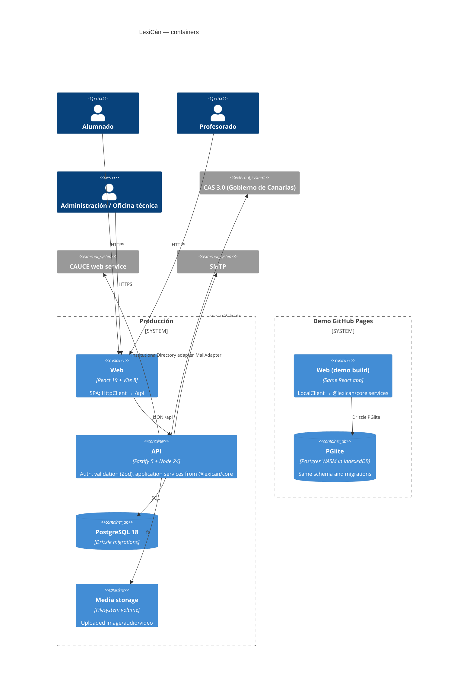
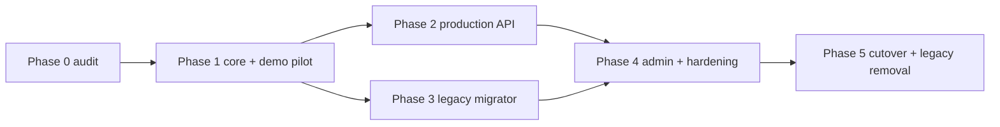

# Modernization Brief — LexiCán

Inputs (2026-10-04): INTENT.md, PREFLIGHT.md, ASSESSMENT.md, BASELINE.md, topology.json, BUSINESS_RULES.md (304
rules), DATA_OBJECTS.md, FUNCTIONAL_INVENTORY.md, UI_SCREENS.md, REFERENCES.md, TECH_RESEARCH.md, `1er-prompt.md`.

> **Approval note.** The user asked for the whole pipeline to run without checkpoints ("si, no me preguntes,
> termina todo"). This brief is therefore executed as written; every decision a reviewer would normally take is
> recorded as a **default** in §7 so it can be overridden later by editing this file.

## 1. Objective

Replace the Laravel 8 / Voyager / phpCAS / MariaDB application (which no longer installs, carries 41 known-vulnerable
dependencies and two confirmed RCE paths) with a TypeScript monorepo: React + Vite front end, Fastify API,
PostgreSQL via Drizzle, and a fully functional GitHub Pages demo running the same application services on PGlite in
the browser. Rebuild from extracted intent (304 rules, 123 inventoried features), fixing the authorization defects
instead of reproducing them, and migrate the legacy MariaDB data and media with a verifiable, idempotent tool.

## 2. Target Architecture



| Legacy component | Target |
|---|---|
| `routes/web.php`, controllers, global helpers | `@lexican/core` application services + operation table → Fastify routes / demo LocalClient |
| Eloquent models + 45 tables | `@lexican/db` Drizzle schema (≈20 tables), one repository implementation, contract-tested on PGlite and Postgres |
| Blade views + jQuery + Bootstrap 4 + TinyMCE | `apps/web` React (CSS Modules, native controls, plain text) |
| `app/Cas`, phpCAS, `userValidatorCAUCE` | `apps/api/src/auth` CAS 3.0 client (fetch + fast-xml-parser) + `InstitutionalDirectory` adapter |
| Laravel sessions (file) | `sessions` table, `__Host-sid` cookie |
| Voyager admin, compass, logs, CSV | Own admin screens: users/roles, vocabularies, classroom validity, stats, audit |
| dompdf | Print CSS view (Save as PDF) + CSV/JSON/DMLex JSON export generated in core |
| `laravel-auditing` | `audit_events` |
| NFS `storage/app/public` | `MediaStorage` (filesystem adapter; bytea adapter in the demo) |
| MariaDB | PostgreSQL only; `tools/legacy-migrator` (mysql2 dev-only) |

## 3. Phased Sequence

Strangler fig is not applicable inside the app (no API seam; legacy cannot install); the rebuild ships behind the
running legacy and replaces it at cutover. Phase 1 is the pilot: the PGlite demo proves the shared core end to end and
is expected to revise this brief.



#### Phase 0 — Audit and characterization
Command: /code-modernization:modernize-reimagine
Modules: (analysis only)
Scale: S
Risk: low; findings may be wrong (mitigated by per-rule citations).
Entry criteria:
- [x] `analysis/lexican/BASELINE.md` exists with a command per number
Exit criteria:
- [x] ASSESSMENT, topology, BUSINESS_RULES, FUNCTIONAL_INVENTORY, UI_SCREENS committed under `analysis/lexican/`

#### Phase 1 — Shared core, schema and GitHub Pages demo (pilot)
Command: /code-modernization:modernize-reimagine
Modules: DiccionarioPersonalController, DicAulaController, EnviosController, EnvioAcepcionController, ComentariosController, PDFController
Scale: XL
Risk: high; PGlite size/perf in the browser (measured 5.5 MB gzip, 1–1.4 s cold start → lazy load after login render); one-schema-two-drivers drift (contract tests on both).
Entry criteria:
- [x] Target stack proven by a scratch test (PREFLIGHT check 3c)
Exit criteria:
- [ ] Contract tests pass on PGlite and on Postgres 18
- [ ] E2E demo journey student → submit → teacher → publish → student passes in Chromium against the `/lexican/` base path
- [ ] Demo published at https://ateeducacion.github.io/lexican/ by the Pages workflow after CI

#### Phase 2 — Production API
Command: /code-modernization:modernize-reimagine
Modules: Cas/CasManager, Auth/CasController, global_helper (userValidatorCAUCE), HomeController, routes/web
Scale: L
Risk: medium; CAS/CAUCE cannot be exercised here (fake adapters + recorded XML); session/CSRF design.
Entry criteria:
- [ ] Phase 1 core services merged
Exit criteria:
- [ ] API integration tests (auth, permissions, validation, 409, uploads) pass against Postgres
- [ ] Production E2E (web + api + Postgres, dev auth provider) runs the same journey as the demo

#### Phase 3 — Legacy data and media migrator
Command: /code-modernization:modernize-reimagine
Modules: all legacy datastores (ds:*)
Scale: L
Risk: high; real data semantics (estado flags, duplicated envíos); PII minimization.
Entry criteria:
- [ ] `docs/LEGACY-DATA-MAPPING.md` covers every legacy table
Exit criteria:
- [ ] CI job: MariaDB fixture → migrator → PostgreSQL → assertions, idempotent re-run, report with counts/orphans

#### Phase 4 — Administration and hardening
Command: /code-modernization:modernize-reimagine
Modules: Voyager/VoyagerCompassController, CSVController, Voyager/*
Scale: M
Risk: medium; admin screens missing from repo (spec from routes + rules only).
Entry criteria:
- [ ] Phases 2 and 3 merged
Exit criteria:
- [ ] Admin screens for users/roles, vocabularies, classroom validity, stats, audit; security review findings closed or recorded

#### Phase 5 — Cutover and legacy removal
Command: /code-modernization:modernize-reimagine
Modules: (all legacy)
Scale: M
Risk: high; production data; rollback = point back to legacy (read-only during cutover).
Entry criteria:
- [ ] Migration rehearsal on an authorized anonymized copy documented in `docs/MIGRATION.md`
Exit criteria:
- [ ] Laravel/Voyager/Composer/Blade/jQuery removed from `main`; `upstream` untouched

## 4. Business Walkthroughs

| Persona flow | Legacy modules | Replaced in |
|---|---|---|
| Alumno crea entrada con acepciones | DiccionarioPersonalController, dpEntradas/dpAcepciones/dpMedios helpers | Phase 1 |
| Alumno envía entradas al aula | EnviosController, dpEnvios_helper | Phase 1 |
| Profesor revisa, publica y comenta | DicAulaController, EnvioAcepcionController, ComentariosController, dicAula_helper | Phase 1 |
| Profesor crea aula y alumnado se une con código | DicAulaController, dicAula_helper, mail_helper | Phase 1 (mail adapter Phase 2) |
| Login CAS + CAUCE | CasManager, CasController, global_helper | Phase 2 |

## 5. Behavior Contract (P0, as redesigned)

Legacy P0 rules flagged as *defects* are **not** reproduced; the contract below is the intended behavior and becomes
the core unit/contract/E2E suite (rule ids in test names).

1. School year starts on a configurable day/month (default 30 Aug); dates before it belong to the previous year (RULE-005).
2. A classroom dictionary is current while `currentYear − startYear < validityYears` or it is timeless (RULE-006; `>` semantics, vigencia N = N school years total, RULE-065 default).
3. Non-current classrooms are read-only and accept no submissions; reactivation by admin extends validity ≤ 10 years (RULE-007 capped).
4. Submission window: enabled AND (start null or now ≥ start) AND (end null or now ≤ end) AND classroom current (RULE-009/230, applied to single and bulk send: RULE-074 fixed).
5. Only active members can submit to a classroom (RULE-072 fixed); only teacher members of that classroom review/publish/comment/edit (RULE-062 default: per-classroom role).
6. Submission copies an immutable revision of the entry's visible senses; later personal edits never alter it (RULE §27).
7. A submission requires ≥1 visible sense, the classroom's required fields, and ≤ max senses when set (RULE-076, -042/043 now enforced).
8. One open submission per (entry, classroom): resubmitting a pending one replaces its revision; after review a new submission is created (RULE-229 default).
9. Publishing creates/updates a classroom entry with provenance (`source_submission_id`); a different-source entry with the same headword (case-insensitive) blocks with 409 (RULE-057); a resubmission from the same source entry updates the published copy (new revision).
10. Rejection is a status with an optional note (replaces hard delete, RULE-148).
11. Headwords are unique per dictionary, case-insensitive, accent-sensitive ("arbol" ≠ "árbol", RULE-094 default), trimmed and whitespace-collapsed.
12. Deleting a personal entry is a soft delete; its pending submissions become `withdrawn`; published classroom copies are unaffected (RULE-127/147).
13. Hidden personal entries are excluded from bulk send and exports by default; hidden classroom entries/senses are invisible to students, visible to teachers (RULE-144 default).
14. Comments are plain text, authored by classroom teachers, addressed to one student, optionally attached to a submission; students see them according to the classroom comment visibility (never / always / created before a date) (RULE-185 default: "before").
15. Join codes: 6 chars from an unambiguous alphabet, server-generated, unique (DB constraint); joining makes an active student member; teachers promote members to teacher; the last teacher cannot be demoted/removed and nobody can disable themselves (RULE-048/049/058).
16. Global roles `student | teacher | admin | support`, recomputed from CAUCE on every login (CAUCE roles 1/4/5 → teacher, else student); admin/support are local grants (RULE-063 fixed).
17. Uploads: image (png/jpeg/webp/gif), audio (mpeg/ogg/wav/webm), video (mp4/webm) by content sniffing, ≤ 1 per kind per sense, size limits server-side (RULE-079/080 fixed).
18. Edits to a reviewed/published entry use optimistic locking (`version`): stale writes get 409 (§65).

## 6. Validation Strategy

| Phase | Validation |
|---|---|
| 1 | Unit tests for domain rules (injected clock), contract tests (same suite, PGlite + Postgres), Playwright E2E on the demo build (3 browsers, axe, console-error fail) |
| 2 | API integration tests with Testcontainers Postgres; production E2E with the dev auth provider; CAS parser tests on recorded XML |
| 3 | Migration tests: MariaDB fixture → migrator → assertions; idempotent rerun; report counts |
| 4 | Security review (harden), a11y manual checklist |
| 5 | Rehearsal on authorized copy, smoke E2E, rollback drill |

Dual execution is impossible (legacy does not install, PREFLIGHT 3b); equivalence comes from the rule cards.

## 7. Open Questions (defaults applied — edit to override)

- [ ] RULE-009/271: window = enabled + optional start/end; "planned" state dropped (default applied).
- [ ] RULE-052: bulk publish publishes every non-conflicting submission and reports conflicts (default).
- [ ] RULE-062/135: classroom teacher role (not global role) governs review; any classroom teacher may promote (default).
- [ ] RULE-065/066: vigencia N = N school years including the start year; timeless has no end date (default).
- [ ] RULE-094: accent-sensitive, case-insensitive headword uniqueness (default).
- [ ] RULE-128/229: resubmission replaces pending revision; reviewed ones start a new submission (default).
- [ ] RULE-144: hidden classroom senses hidden from students (default).
- [ ] RULE-185: comment visibility mode "before date" shows comments created on/before the date (default).
- [ ] RULE-236: media served only to users who can read the entry (default, fixes public URLs).
- [ ] RULE-194/203/206: legacy ids differ per environment → migrator maps by label/code, never id.
- [ ] Inventory Q1–Q8: "Canarismos" type dropped (kept as admin vocabulary value `dictionary_type` for migration fidelity); max senses enforced when set; browser recording kept (MediaRecorder) only if time allows — otherwise file upload covers it; guidelines plain text; centros kept as `schools` for stats only; vigencia computed on read (no batch job needed).
- [ ] **Credentials committed in the public repo (`.env.example`, seeders, `global_helper.php:873`) must be rotated by operations; history rewrite is forbidden by §5.**

## 8. Approval Block

```
Approved by: (executed without checkpoint at the user's request, 2026-10-04)  Date: 2026-10-04
Approval covers: Full plan
```
