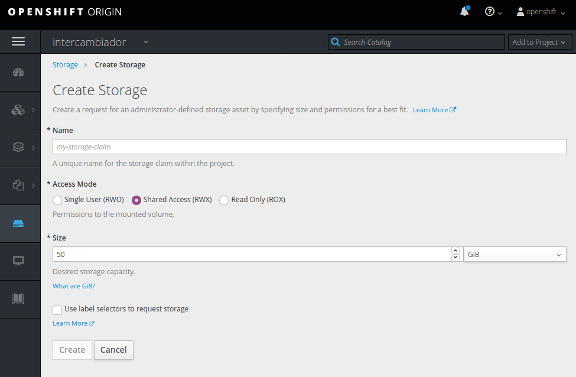

# Lexican 1.2.2

- [Lexican 1.2.2](#lexican-122)
  - [Requisitos para configuración entorno local](#requisitos-para-configuración-entorno-local)
  - [Configurar Desarrollo local](#configurar-desarrollo-local)
  - [Preparar la imagen para entorno de preproducción y producción](#preparar-la-imagen-para-entorno-de-preproducción-y-producción)
    - [1. Creando la imagen con deploy.sh](#1-creando-la-imagen-con-deploysh)
    - [2. Hacer login en el repositorio de imágenes](#2-hacer-login-en-el-repositorio-de-imágenes)
    - [3. Crear tag de la imagen creada](#3-crear-tag-de-la-imagen-creada)
    - [4. Hacer un push de la imagen al Docker Registry](#4-hacer-un-push-de-la-imagen-al-docker-registry)
  - [Configurar la imagen en PRE](#configurar-la-imagen-en-pre)
    - [5. Conectar a maquina master](#5-conectar-a-maquina-master)
    - [6. en la maquina cambiar al proyecto openshift correspondiente](#6-en-la-maquina-cambiar-al-proyecto-openshift-correspondiente)
    - [7. Traer la imagen de www.canariaseducacion.org](#7-traer-la-imagen-de-wwwcanariaseducacionorg)
    - [8.A. hacer deploy con new-app](#8a-hacer-deploy-con-new-app)
    - [8.B. importarla](#8b-importarla)
    - [9. Crear secret en openshift](#9-crear-secret-en-openshift)
    - [10. Volumenes NFS](#10-volumenes-nfs)
  - [Variables de entorno](#variables-de-entorno)
  - [Tamaño máximo de subida de archivo](#tamaño-máximo-de-subida-de-archivo)
  - [Usuarios predefinidos](#usuarios-predefinidos)
  - [Soluciones a incidencias que han aparecido en la istalación](#soluciones-a-incidencias-que-han-aparecido-en-la-istalación)
    - [Limpiar todos los caches](#limpiar-todos-los-caches)
    - [Actualizar Paquetes Composer](#actualizar-paquetes-composer)
    - [No carga despues de hacer login en adminstracion/voyager](#no-carga-despues-de-hacer-login-en-adminstracionvoyager)
    - [Permisos](#permisos)
  - [Pruebas Tests](#pruebas-tests)
  - [Documentacion](#documentacion)

## Requisitos para configuración entorno local

Instalar docker si no lo tenemos tal como se ve en http://get.docker.com, 
agregar tu usuario al grupo docker

> sudo usermod -aG docker $USER

Es necesario tener instalado npm, puedes instalarlo con nvm https://github.com/nvm-sh/nvm#install--update-script


Permisos de los archivos, asegurate de poder escribir en /scr/storage


## Configurar Desarrollo local

Para facilitar la configuracion se usa el script **./deploy.sh**

La primera vez que ejectuamos el script tenemos que configurar la base de datos como se indica a continuacion, con rebuilddb indicamos que se cree la bbdd y luego entramos en el contenedor y ejecutamos el script provision.sh 

```shell
$ ./deploy.sh local rebuild 
$ docker exec -ti lexican_web_local /bin/bash
```

Entra en la base de datos y crea la base de datos 'lexican' o el nombre que le hayas puesto en 'deploy.sh' para que pueda crear los datos en esta.

luego dentro del contenedor ejecutamos el script provision.sh

```shell
cd /var/www/html/medusa/apps/lexican
 bash ./provision.sh 
```

Con estas variables, que están al principio del archivo deploy.sh, podemos cambiar el nombre de lo contenedores, usuarios y claves

```bash
CONTAINERDB="basedatos"
DBROOTPASS="rootpass"
DB_NAME="lexican"
DB_USER="root"
DB_PASS=$DBROOTPASS
```

Si ya tenemos un contenedor de MariaDB podemos reutilizarlo rellenando estas variables con los 
datos correspondientes, CONTAINERDB sería el nombre del contenedor.


Con ejecutar:

```shell
$ ./deploy.sh local rebuild
```

Nos creará la imagen según los parámetros que tenemos en las variables del script 
podemos modificar los puertos, el nombre del contenedor y demás a través de estas.

Al terminar de ejecutarse el script veremos un mensaje similar a este, con el link que nos lleva a la web local:

```shell
Acede a http://localhost:8083/medusa/apps/lexican para probar la web
 Para acceder a la shell del contenedor:
docker exec -ti lexican_web_local /bin/bash
```

## Preparar la imagen para entorno de preproducción y producción


### 1. Creando la imagen con deploy.sh

Creamos la imagen de la versión que está ahora mismo activa en el git, o cambiamos a la etiqueta que se va a subir con:

```shell
$ git checkout v1.0.0 
```

Creamos la imagen con el comando:

```shell
$ ./deploy.sh pre rebuild 
```

Con *docker images* podemos ver que efectivamente se ha creado

```shell
$ docker images lexican-apache
```

<!-- Podemos probarla en local con la url que nos aparece y modificando el archivo *hosts* de nuestro pc -->

### 2. Hacer login en el repositorio de imágenes

```shell
$ docker login www.canariaseducacion.org
```
    usuario: u_gitsmart
    contraseña: <consultar>


### 3. Crear tag de la imagen creada

```shell
$ docker tag lexican-apache:latest www.canariaseducacion.org/lexican/lexican:x.x.x-rcxx
```
donde se sustituiran las x por la version correspondiente por ejemplo lexican:1.0.4-rc1

### 4. Hacer un push de la imagen al Docker Registry

```shell
$ docker push www.canariaseducacion.org/lexican/lexican:x.x.x-rcxx
```

## Configurar la imagen en PRE

### 5. Conectar a maquina master

> ssh root@IP.NODO.MASTER.OpenShift
 
### 6. en la maquina cambiar al proyecto openshift correspondiente

> oc project intercambiador

### 7. Traer la imagen de www.canariaseducacion.org

Esto solo lo tendrás que hacen una vez si no existe la imagen de antes
 las siguientes has el paso **[8.B.](#8.b.-importarla)** directamente

> docker pull www.canariaseducacion.org/lexican/lexican:1.0.0-rc1

### 8.A. hacer deploy con new-app

> oc new-app --docker-image=www.canariaseducacion.org/lexican/lexican:1.0.0-rc1
### 8.B. importarla

> oc import-image lexican:1.0.0-rc1 --from=www.canariaseducacion.org/lexican/lexican:1.0.0-rc1


### 9. Crear secret en openshift

voy a la parte de [secrets de proyecto lexican](https://master-openshiftpre.medusa.gobiernodecanarias.net:8443/console/project/lexican/create-secret)
<!-- https://master-openshiftpre.medusa.gobiernodecanarias.net:8443/console/project/lexican/create-secret -->

En **Resources/secrets** pulsamos en el boton *create secrect*
En el formulario ponemos 
*  **secrect type** : *image secrect*
* el nombre que queramos en **secrect name**
* **Autentication type** : *configuration file*
* copiamos los datos que estan en nuestro ~/.docker en cuadro de texto, solo la parte que pone auths
  
Debe quedar algo asi: 
```json
{
    "www.canariaseducacion.org": {
        "auth": "<cadena auth>"
    }
},
```
 * y pulsamos en **Crear** 

  Luego en Aplication/Deployments/ picamos en nuestra imagen (lexcan) y arriba a la derecha pulsamos
  **Actions / edit** en la seccion **Images** escogemos nuestro namespace, imagen y tag

  puslamos en el link que aparece como:

"To set secrets for pulling your images from private image registries, **view advanced image options.**"

  y en el listado del select que nos aparece pulsamos el nuestro que acabamos de crear.

### 10. Volumenes NFS

Solo es necesario la primera vez, para configurarlo se crean los archivos:

intercambiador-nfs-lexican-logs-pv.yaml 
```yaml
apiVersion: v1
kind: PersistentVolume
metadata:
  labels:
    app: lexican
  name: lexican-nfs-lexican-logs-pv
spec:
  accessModes:
  - ReadWriteMany
  capacity:
    storage: 5Gi
  claimRef:
    apiVersion: v1
    kind: PersistentVolumeClaim
    name: lexican-nfs-lexican-logs-pv
    namespace: lexican
  nfs:
    path: /var/nfs/lexican-log
    server: omds0005.medusa.gobiernodecanarias.net
  persistentVolumeReclaimPolicy: Recycle

```
intercambiador-nfs-lexican-archivos-pv.yaml 
```yaml
apiVersion: v1
kind: PersistentVolume
metadata:
  labels:
    app: lexican
  name: lexican-nfs-lexican-archivos-pv
spec:
  accessModes:
  - ReadWriteMany
  capacity:
    storage: 50Gi
  claimRef:
    apiVersion: v1
    kind: PersistentVolumeClaim
    name: lexican-nfs-lexican-archivos-pv
    namespace: lexican
  nfs:
    path: /var/nfs/lexican-archivos
    server: omds0005.medusa.gobiernodecanarias.net
  persistentVolumeReclaimPolicy: Recycle
```

<!-- cp itcbeva-nfs-itcb-logs-pv.yaml lexican-nfs-lexican-archivos-pv.yaml -->
<!-- vi lexican-nfs-lexican-archivos-pv.yaml  -->
y se pasan a openshift con:

> oc create -f lexican-nfs-lexican-archivos-pv.yaml 

luego crear storage en [openshift origin](https://master-openshiftpre.medusa.gobiernodecanarias.net:8443/console/project/lexican/browse/storage) 



Los datos que necesitamos se corresponderian con los de los ficheros yaml de cada storage

* **Name:** seria el nombre que hemos puesto en cada volumen en spec/ClainRef/name

* **Size:** el mismo que definimos en spec/capacity/storage

* **Access Mode:** Shared Access seria el equivalente a ReadWriteMany en spec/AccessModes


Agregar al deployment de [lexican](https://master-openshiftpre.medusa.gobiernodecanarias.net:8443/console/project/lexican/attach-pvc?kind=DeploymentConfig&name=lexican)  en Deployments > lexican > Add Storage 

Con estos datos 

| nombre |  mount path                                           |
|--------|-------------------------------------------------------|
| medios |  /var/www/html/medusa/apps/lexican/storage/app/public |
| logs   |  /var/www/html/medusa/apps/lexican/storage/logs       |

subpath y volumen name se puede dejar vacío 

## Variables de entorno

Relacion de variables y su descripción:

| Nombre            | Descripción                                                                                           | Valores, ejemplos                                  |
| ----------------- | ----------------------------------------------------------------------------------------------------- | -------------------------------------------------- |
| APP_VERSION       | Para visualizar la version en OpenShift                                                               | 1.0.4                                              |
| APP_ENV           | Entorno de aplicacion                                                                                 | local, develop, preproduction o production         |
| APP_DEBUG         | Activa modo debug                                                                                     | true / false                                       |
| APP_URL           | URL pagina                                                                                            | https://www3.gobiernodecanarias.org/medusa/lexican |
| ASSET_URL         | Se usa es para generar urls con comando artisan  (ver descripcion en app.php)                         |                                                    |
| UPLOAD_MAXSIZE    | Tamaño máximo de archivos subidos por formularios                                                     | Numero de megas,  75                               |
| INICIO_CURSO      | Fecha en la que empieza el curso escolar, solo se tiene en cuenta mes y dia poner siempre el año 2000 | 30/8/200                                           |
| VIGENCIA_MAX      | Numero maximo de cursos que puede estar vigente un diccionario de aula                                | 10                                                 |
|                   |                                                                                                       |                                                    |
| CAS_HOSTNAME      | host del cas                                                                                          | url                                                |
| CAS_VALIDATION    |                                                                                                       | url                                                |
| CAS_VERSION       | version del cas                                                                                       | 3.0                                                |
| CAS_LOGOUT_URL    | url logout cas                                                                                        |                                                    |
| CAUCE_WEBSERVICE  | url webservice cauce                                                                                  |                                                    |
| CAUCE_BEARER      | token bearer del cauce                                                                                |                                                    |
|                   |                                                                                                       |                                                    |
| DB_HOST           | host base de datos                                                                                    |                                                    |
| DB_DATABASE       | nombre base de datos                                                                                  |                                                    |
| DB_USERNAME       | usuario                                                                                               |                                                    |
| DB_PASSWORD       | clave                                                                                                 |                                                    |
|                   |                                                                                                       |                                                    |
| MAIL_DRIVER       | modo envio de correo                                                                                  | smtp                                               |
| MAIL_HOST         | host servicio envio correo                                                                            |                                                    |
| MAIL_PORT         | puerto                                                                                                |                                                    |
| MAIL_USERNAME     | usuario correo                                                                                        | dic.canarismos@gmail.com                           |
| MAIL_PASSWORD     | clave correo                                                                                          |                                                    |
| MAIL_ENCRYPTION   |                                                                                                       | tls                                                |
| MAIL_FROM_ADDRESS | direccion remitente de los correos enviados                                                           | noreply@diccionarioCanarismos.es                   |
| MAIL_FROM_NAME    | nombre remitente                                                                                      | Diccionario                                        |
|                   |                                                                                                       |                                                    |


## Tamaño máximo de subida de archivo

En la variable UPLOAD_MAXSIZE se define el tamaño máximo de los archivos, esta variable se usa 
tanto en openshift para definir el máximo como en deploy.sh, la diferencia es que al crear la imagen 
se guarda en el php.ini y no se puede modificar hasta rehacer la imagen.

Por otro lado en laravel en src/config/ctes.php, linea 312, los valores en 'dropify' se usan para definir el máximo que permite dropify para cada tipo de archivo, cambiando este sin problema cada vez que se cambia la variable de entorno en openshift.

Por lo tanto el máximo en php.ini se queda siempre como se hizo al crear la imagen y el que se encuentra en las constantes de Laravel se puede cambiar, pero nuca a más de lo que está establecido en php.ini

Por ejemplo, si tenemos en la imagen como máximo 100MB y queremos ponerlo a 105MB daría error al intentar subir un archivo, pero si por el contrario es bajarlo a 50MB no habría problema alguno, ni sería necesario crear una nueva imagen.

## Usuarios predefinidos

puedes verlos en el archivo [UserRorelsTablesSeeder](src/database/seeders/UsersRolesTablesSeeder.php) y entrar desde 
http://localhost:8083/medusa/apps/lexican/admin/login

<!-- # Acceder a los datos

Se puede instalar un programa como dbeared-ce o mysql workbench para ver los datos y conectarnos con los datos que estan en deploy.sh
como si fuera una bbdd local , 

## Fallo: no estan los datos predefinidos en la bbdd

Puede que haya fallado algo en la ejecucion del archivo provision.sh, puedes volver a lanzarlo o revisar DatabaseSeeder.php y lanzar los seeders por separado

### Esta parte no me funicono y pero inira en lugar del docker pull de arriba en el paso 8 

## 8 importarla

> oc import-image lexican:1.0.0-rc1 --from=www.canariaseducacion.org/lexican/lexican:1.0.0-rc1

* Importarla a openshift
  
> oc import-image lexican:1.0.0-rc1 --from=www.canariaseducacion.org/lexican/lexican:1.0.0-rc1

Si aparce este error:

> error: no image stream named "lexican" exists, pass --confirm to create and import

lo vuelvo ejecutar con --confirm  -->

## Soluciones a incidencias que han aparecido en la istalación

### Limpiar todos los caches

Prueba esto antes de cambiar nada, a veces es el unico problema:

> artisan optimize:clear

### Actualizar Paquetes Composer

Recomiendo hacerlo de esta manera ya que a veces no muestra errores si no estamso dentro del contenedor 

* Entrar en el contenedor  y ejecutar composer update y install

>  docker exec -ti lexican_web_local bash
> /var/www/html/medusa/apps/lexican#  composer update
> /var/www/html/medusa/apps/lexican#  composer install

### No carga despues de hacer login en adminstracion/voyager 

y nos aparece este mensaje de error:

```php
Error " Attempt to read property "name" on null (View: /vendor/tcg/voyager/resources/views/dimmers.blade.php) "
```

Para solucionarlo hay que reinstalar voyager.

En provision.sh hace todos los pasos para configurar nuestro entorno pero si obetemos fallos en archivo vendor es problable que necesitemso reinstalar o acutualizar el paquete que da problemas

Primero actualizar como dice arriba los paquetes de composer

Luego podremos ejecutar:

```terminal
 /var/www/html/medusa/apps/lexican# composer update
 /var/www/html/medusa/apps/lexican# composer dump-autoload -o
 /var/www/html/medusa/apps/lexican# php artisan voyager:install --with-dummy
 /var/www/html/medusa/apps/lexican# php artisan db:seed --class=DatabaseSeeder
```

en maquina dev:

```
php81 composer.phar update
php81 composer.phar dump-autoload -o
php81 artisan voyager:install --with-dummy
php81 artisan db:seed --class=DatabaseSeeder
```

El ultimo comando puede no ser necesario y  nos puede dar error si ya tenemos entos datos en la bbdd pero no borrara nuestors datos

Despues de esto ya deberiamos poder acceder
<!-- lo vuelvo ejecutar con --confirm -->

### Permisos

Si da error de falta de permisos en storage/framework o logs es recomendable poner los permisos asi:

    $ sudo chown www-data.$USER -R storage/*

dentro del contenedor, recuerda que al crear el contenedor para pre y pro los permisos se cambian en el Dockerfile, 
asi que estos se quedan bien aunque le hubieses puesto 777 a todos los archivos en algun momento


## Pruebas Tests

Las pruebas en /src/tests/ las podemos ejecutar dentro del contenedor o el pod de esta manera

```shell
/var/www/html/medusa/apps/lexican# ./vendor/bin/phpunit 
```

O esta que muestra mas mensajes:
```shell
/var/www/html/medusa/apps/lexican# php artisan test
```


## Documentacion

Se estaba usando phpdox ( en composer "theseer/phpdox": "0.12.0" ), pero no se 
actualiza desde 2019, se puede usar phpDocumentor https://www.phpdoc.org/

con docker se puede instalar asi:

desde el directorio src 
```shell
$ docker run --rm -v ${PWD}:/data phpdoc/phpdoc:3

$ alias phpdoc="docker run --rm -v $(pwd):/data phpdoc/phpdoc:3"
```

ahora podemos usar el comando phpdoc

phpdoc -d . -t docs


