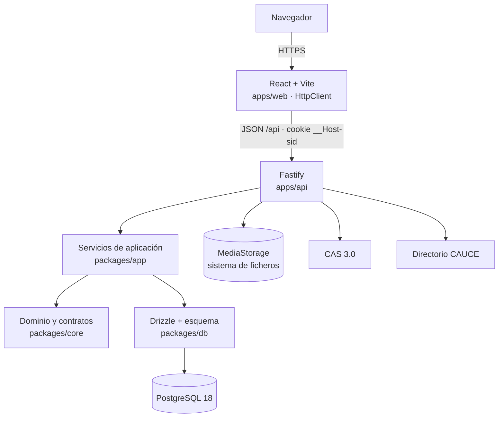
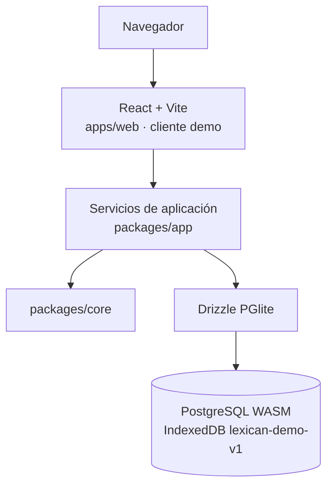

# Arquitectura

LexiCán tiene dos modos de ejecución que comparten casi todo el código: **producción** (web + API Fastify +
PostgreSQL) y **demo** estática en GitHub Pages (web + PGlite en el navegador). Decisiones: `docs/adr/`.

## Producción



Despliegue conceptual: **un proceso Node.js** (sirve también el SPA compilado) + **PostgreSQL** + **un volumen para
medios**. Sin Redis, colas ni servicios adicionales (`docs/DEPLOYMENT.md`).

## Demo (GitHub Pages)



No hay API: el navegador ejecuta los **mismos** servicios con la **misma** autorización sobre la **misma** migración.

## Cómo se comparte el código

| Pieza | Producción | Demo |
|---|---|---|
| Tipos, validación Zod, reglas de curso/vigencia/plazos, exportaciones | `packages/core` | `packages/core` |
| Casos de uso y autorización | `packages/app` en Fastify | `packages/app` en el navegador |
| Esquema y migraciones | `packages/db` en node-postgres | `packages/db` en PGlite |
| Contrato de la API | `operations` (core) → rutas Fastify | `operations` → llamadas en proceso |
| Sesión | cookie + tabla `sessions` | usuario ficticio elegido en el navegador |
| Medios | sistema de ficheros | tabla `media_blobs` |
| Autenticación | CAS + CAUCE (proveedor de contraseña solo en dev/test) | cuentas ficticias |

### La tabla de operaciones

`packages/core/src/operations.ts` declara cada operación una sola vez: verbo HTTP, ruta REST y esquema Zod de entrada.
De ella salen:

- las rutas de Fastify (`apps/api`), que solo hacen *sesión → validación → servicio → respuesta*;
- el `HttpClient` del navegador (`apps/web/src/api/http.ts`);
- el cliente de la demo (`apps/web/src/demo/client.ts`), que llama a los servicios directamente.

Añadir una funcionalidad = una entrada en la tabla + un caso de uso en `packages/app` + su prueba de contrato.

## Capas

```text
apps/web ──► packages/core (siempre)
         └─► packages/app + packages/db + PGlite (solo build demo, import dinámico)
apps/api ──► packages/app ──► packages/db ──► PostgreSQL
                         └─► packages/core
packages/core: sin dependencias de React, Fastify ni Drizzle
```

## Rutas de la interfaz

| Ruta | Quién | Qué |
|---|---|---|
| `/entrar` | todos | acceso (CAS en producción; cuentas ficticias en la demo) |
| `/mi-diccionario` | todos | buscador, abecedario, temáticas, nueva palabra |
| `/mi-diccionario/entradas/:id` | propietario | ficha, envío al aula, estado de envíos, comentarios |
| `/mi-diccionario/enviar` | propietario | envío de varias entradas |
| `/aulas` | todos | panel por tareas (pendientes de revisar), unirse con código |
| `/aulas/:id` | participantes | visor del diccionario de aula |
| `/aulas/:id/envios` | profesorado del aula | bandeja de revisión |
| `/aulas/:id/participantes` | profesorado del aula | roles y altas/bajas |
| `/diccionarios/:id/imprimir` | lectores | imprimir/PDF, CSV, JSON, DMLex |
| `/admin/*` | administración / oficina técnica | vigencia, usuarios, listas, estadísticas, auditoría |
