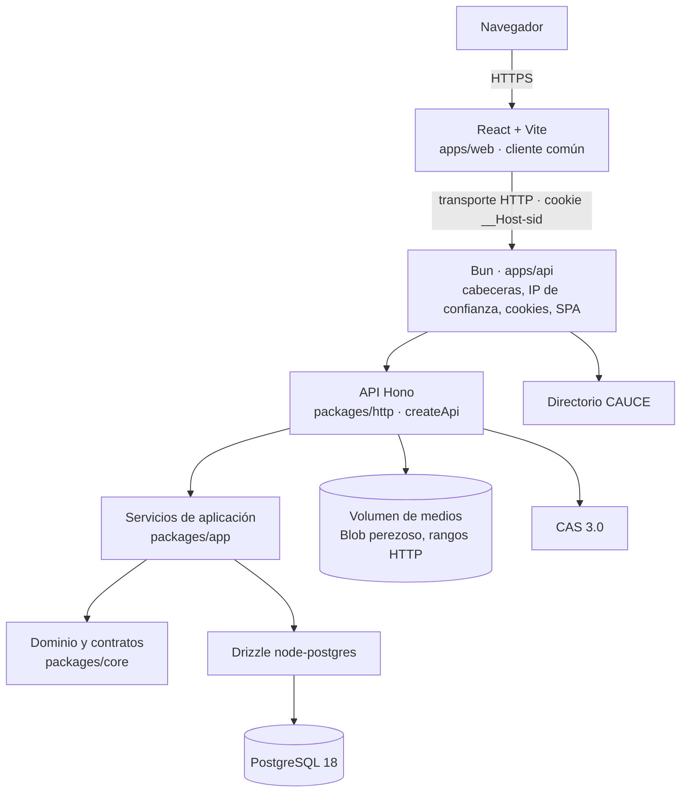
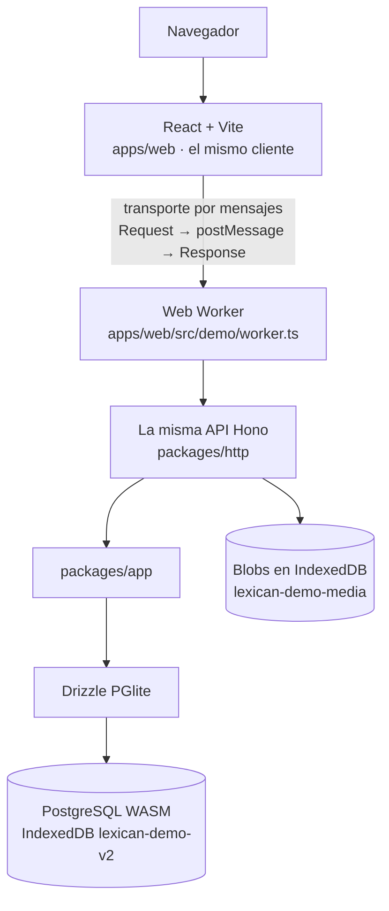

# Arquitectura

LexiCán tiene dos despliegues que ejecutan **la misma aplicación Hono, los mismos servicios y las mismas reglas**:
**Docker** (Bun + PostgreSQL + volumen de medios) y la **demo** estática de GitHub Pages (un Web Worker con PGlite).
Decisiones: `docs/adr/`, en especial [ADR 0009](adr/0009-hono-bun-worker.md).

## Docker



Despliegue: **un proceso Bun** (API + SPA compilado) + **PostgreSQL** + **un volumen para medios**. Sin Redis, colas
ni servicios adicionales (`docs/DEPLOYMENT.md`).

## Demo (GitHub Pages)



React nunca llama a los servicios: cada operación atraviesa la ruta Hono, la validación, la serialización JSON y el
tratamiento de errores, igual que en Docker. PGlite y la API trabajan fuera del hilo de la interfaz.

## Qué cambia entre ambos (solo adaptadores y configuración)

| Pieza | Docker | Pages |
|---|---|---|
| API, rutas, validación, errores, límites | `packages/http` | `packages/http` (idéntico) |
| Casos de uso y autorización | `packages/app` | `packages/app` (idéntico) |
| Esquema y migraciones | `packages/db` en node-postgres | `packages/db` en PGlite |
| Transporte del cliente | `fetch` HTTP | mensajes al Worker (`demo/transport.ts`) |
| Sesión (filas `sessions`) | cookie `__Host-sid` `HttpOnly` | identificador opaco en `localStorage`, en el sobre del mensaje |
| Estado de acceso CAS | cookie `__Host-cas_state` | `sessionStorage` |
| CSRF (`Origin`) | comprobado | no aplica: solo esta página habla con su Worker |
| Medios | volumen (`openAsBlob`), `/media/:id` con rangos | Blobs en IndexedDB → URL `blob:` |
| Perfiles CAS | CAUCE (producción) o fichas de prueba (`APP_ENV=local`) | fichas de prueba |
| SLO por *back-channel* | sí | imposible en un sitio estático |
| IP de cliente | socket + `X-Forwarded-For` solo por proxies de confianza | constante `local` |

### La tabla de operaciones

`packages/core/src/operations.ts` declara cada operación una sola vez: verbo HTTP, ruta REST y esquema Zod de entrada.
De ella salen las rutas Hono (`packages/http`), que solo hacen *identidad → validación → servicio → respuesta*, y el
cliente único del navegador (`apps/web/src/api/client.ts`), que funciona sobre cualquier transporte.

Añadir una funcionalidad = una entrada en la tabla + un caso de uso en `packages/app` + su prueba de contrato.

### Excepciones al «todo es una petición»

- Las navegaciones de acceso (ir al CAS y volver) no son peticiones de datos: en Docker son enlaces reales; en Pages
  el Worker responde `302` y la página navega solo hacia el CAS configurado (`demo/transport.ts`).
- Los medios: en Docker `<audio>`/`` cargan `/media/:id` directamente (rangos, *streaming*); en Pages se piden
  por el transporte y se muestran como URL `blob:`, que se revocan al cambiar de identidad o restablecer la demo.

## Capas

```text
apps/web ──► packages/core (siempre)
         └─► Worker: packages/http + packages/app + packages/db + PGlite (solo build demo, carga diferida)
apps/api ──► packages/http ──► packages/app ──► packages/db ──► PostgreSQL
                                           └─► packages/core
packages/core, packages/app, packages/http: solo APIs web (sin node:*, pg ni Bun; Biome lo comprueba)
```

## Rutas de la interfaz

| Ruta | Quién | Qué |
|---|---|---|
| `/entrar` | todos | acceso (CAS institucional en producción; CAS de pruebas y cuentas ficticias en local y en la demo) |
| `/mi-diccionario` | todos | espacio de trabajo en tres columnas: lista con buscador, abecedario, temáticas y estado de cada entrada; ficha de lectura; panel lateral con estado en las aulas, comentarios y exportación. En móvil, lista y ficha por separado con navegación inferior |
| `/mi-diccionario/entradas/:id` | propietario | la misma vista con la entrada abierta |
| `/mi-diccionario/nueva`, `/mi-diccionario/entradas/:id/editar` | propietario | editor estructurado: esquema de la entrada, tarjetas de acepción, vista previa y comprobación de las pautas del aula antes de enviar |
| `/mi-diccionario/enviar` | propietario | envío de varias entradas |
| `/aulas` | todos | panel por tareas (pendientes de revisar), unirse con código |
| `/aulas/:id` | participantes | visor del diccionario de aula |
| `/aulas/:id/envios`, `/aulas/:id/envios/:envioId` | profesorado del aula | espacio de revisión: cola con publicación en bloque, instantánea fija del envío, panel de decisión y conversación |
| `/aulas/:id/participantes` | profesorado del aula | roles y altas/bajas |
| `/diccionarios/:id/imprimir` | lectores | imprimir/PDF, CSV, JSON, DMLex |
| `/admin/*` | administración / oficina técnica | vigencia, usuarios, listas, estadísticas, auditoría |

Tipografías Lexend (interfaz) y Literata (palabras y ejemplos), autoalojadas con el build: ninguna petición a CDNs
externos ([THIRD_PARTY_NOTICES.md](../THIRD_PARTY_NOTICES.md)).
