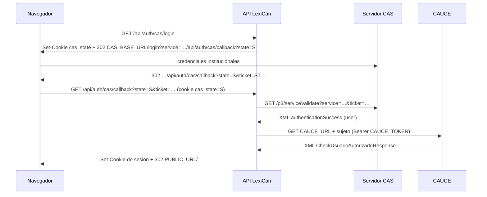

# Autenticación

Demo y producción se autentican de forma distinta y no comparten credenciales. Decisión:
[ADR 0005](adr/0005-autenticacion.md).

| Entorno | Proveedor | Dónde |
|---|---|---|
| Producción | CAS 3.0 + directorio CAUCE | `apps/api/src/cas.ts`, `apps/api/src/cauce.ts`, `apps/api/src/app.ts` |
| Desarrollo y tests | contraseña con cuentas sembradas (`AUTH_DEV_LOGIN=true`) | `packages/app/src/auth.ts` |
| Demo (Pages) | cuentas ficticias en el navegador | `apps/web/src/demo/` |

`GET /api/auth/providers` devuelve `{ cas, password }` y la pantalla de acceso muestra solo lo habilitado.

## Flujo CAS 3.0

- La URL de servicio es `${PUBLIC_URL}/api/auth/cas/callback?state=<aleatorio>`, nunca derivada de la petición.
  Protección contra *login CSRF*: el `state` (192 bits) viaja también en la cookie `cas_state` (`__Host-cas_state`
  con HTTPS; `HttpOnly`, `SameSite=Lax`, 5 min). El callback exige que coincidan, la borra y valida el ticket con esa
  misma URL, así que un ticket emitido para otro navegador no sirve. El CAS debe aceptar la URL de servicio con
  `?state=…` (registro por prefijo o patrón).
- El ticket se valida en `/p3/serviceValidate` con `fetch` (TLS verificado, *timeout* de 5 s, sin seguir
  redirecciones). El XML se analiza con `fast-xml-parser` y se rechaza cualquier `<!DOCTYPE`/`<!ENTITY`.
- Errores: el callback redirige a `/entrar?error=cas|forbidden|unavailable`. Se registra solo el código, nunca el
  ticket ni la respuesta de CAUCE.
- `CAS_BASE_URL` vacío desactiva CAS. Si se define, `CAUCE_URL` y `CAUCE_TOKEN` son obligatorios o la API no arranca.

## Adaptador CAUCE

`InstitutionalDirectory.lookup(subject)` (`apps/api/src/cauce.ts`):

- `httpDirectory`: `GET ${CAUCE_URL}${encodeURIComponent(sujeto)}` con `Authorization: Bearer`, TLS verificado
  (el legacy lo desactivaba), *timeout* de 5 s y `redirect: 'error'`. Fallo de red o HTTP → `unavailable`.
- `parseCauceResponse` lee **solo** nombre, apellidos, correo opcional y centros (código, nombre, rol).
  `NifNie`, `Pasaporte` y `CIAL` se ignoran y no salen de la función.
- `MensajeError` o un usuario sin nombre → `forbidden` («Tu usuario no está autorizado en LexiCán»).
- Centros sin código → centro comodín `00000000` «Sin centro educativo» (como en el legacy).
- `fakeDirectory` (perfiles fijos) para tests. Los XML de prueba son ficticios: `apps/api/src/__fixtures__/`.

## Roles

| Origen | Rol global |
|---|---|
| CAUCE rol `1`, `4` o `5` en algún centro | `teacher` |
| Cualquier otro rol CAUCE | `student` |
| Concesión local por administración (`/admin/usuarios`) | `admin` o `support`; se conserva en cada acceso |

El rol `teacher`/`student` se **recalcula en cada acceso** (el legacy solo lo calculaba al crear el usuario). El rol
global no da permisos dentro de un aula: ahí manda el rol de participación (`dictionary_memberships.role`), comprobado
en `packages/app/src/access.ts`.

## Sesiones

| Aspecto | Valor |
|---|---|
| Identificador | 256 bits aleatorios (`randomBytes(32)`) en la cookie; en la tabla `sessions` solo su SHA-256 |
| Cookie | `__Host-sid` si `PUBLIC_URL` es `https` (`Secure`); `sid` si es `http` (solo local) |
| Atributos | `HttpOnly`, `SameSite=Lax`, `Path=/`, `Max-Age` = TTL |
| Caducidad | `SESSION_TTL_HOURS` (por defecto 8, máximo 720); se desliza como mucho cada 5 minutos de actividad |
| Fijación | cada acceso crea una fila nueva y borra la anterior; las caducadas se purgan al iniciar sesión |
| Logout | `POST /api/auth/logout` (borra la fila y la cookie) o `GET /api/auth/cas/logout` (además redirige a `CAS_BASE_URL/logout`) |
| Usuario deshabilitado | `users.status = 'disabled'` invalida la sesión en la siguiente petición |

No hay tokens en `localStorage` ni Redis.

## CSRF y origen

- Todo método distinto de `GET`/`HEAD`/`OPTIONS` exige `Origin` igual al origen de `PUBLIC_URL`; si no, 403.
- `SameSite=Lax` en la cookie.
- La API solo acepta JSON y *multipart* (se elimina el parser `text/plain`); el *form-encoding* solo existe en la ruta
  de SLO.
- CORS cerrado: no se registra ningún plugin CORS.

## Single logout (SLO)

`POST /api/auth/cas/slo` y `POST /api/auth/cas/callback` (el CAS envía el SLO a la URL de servicio si no tiene una
URL de logout registrada) reciben el `logoutRequest` por *back-channel*, extraen el `SessionIndex` (debe empezar por
`ST-`) y borran las sesiones con ese `cas_ticket`. Están exentos de la comprobación de `Origin`.
`CAS_ALLOWED_SLO_HOSTS` restringe las IP de origen (lista separada por comas); en producción con CAS es obligatoria y
la API no arranca sin ella. Detrás de un proxy inverso hay que fijar `TRUST_PROXY` para que la IP sea la real.

## Proveedor de contraseña (desarrollo)

- `AUTH_DEV_LOGIN=true` habilita `POST /api/auth/login` con las cuentas sembradas por `npm run db:seed -- --demo`
  (las mismas de la demo).
- `loadConfig()` **rechaza arrancar** con `AUTH_DEV_LOGIN=true` y `NODE_ENV=production`; `db:seed --demo` también se
  niega en producción.
- Contraseñas con PBKDF2-SHA256 (100 000 iteraciones, WebCrypto), proveedor `password` en `auth_identities`.
- Límite: 10 intentos por minuto.

## Demo

El acceso de la demo valida las contraseñas ficticias con el mismo servicio `login`, pero dentro del navegador. Solo
decide qué usuario ficticio actúa; **no es una frontera de seguridad** ([DEMO.md](DEMO.md)).

## Pendiente de verificar en preproducción

CI no puede llegar al CAS ni a CAUCE reales. Antes de producción:

1. Que el CAS del Gobierno de Canarias acepte `/p3/serviceValidate` y la URL de servicio exacta registrada.
2. Formato real de la respuesta (atributos, espacios de nombres) y del identificador de usuario.
3. Que el SLO por *back-channel* llegue (IP de origen para `CAS_ALLOWED_SLO_HOSTS`, alcance de red, formato del
   `logoutRequest`).
4. Respuesta real de CAUCE: entidades HTML, centros sin código, roles, códigos de error y latencia frente al
   *timeout* de 5 s.
5. Que los usuarios y roles migrados coinciden con el sujeto CAS (`auth_identities.subject`).
6. Cookie `__Host-sid` detrás del proxy real (HTTPS de extremo a extremo hasta el navegador).
7. Que ningún log contiene tickets, tokens ni datos de CAUCE.
