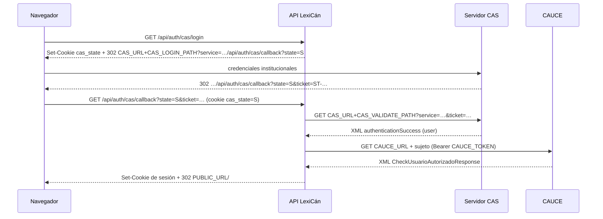

# Autenticación

Decisiones: [ADR 0005](adr/0005-autenticacion.md) y [ADR 0009](adr/0009-hono-bun-worker.md). Docker y Pages comparten
la lógica de sesión de `packages/http`; cambia cómo viaja la sesión. El cliente CAS se usa solo en el servidor.

| Entorno | Proveedores | Perfiles |
|---|---|---|
| Producción (`APP_ENV=production`) | CAS institucional | CAUCE (`apps/api/src/cauce.ts`), emisor `cas` |
| Docker local (`APP_ENV=local`) | CAS público de pruebas + contraseña de cuentas sembradas | fichas ficticias (`packages/app/src/directory.ts`), emisor `cas_test` |
| Tests (`APP_ENV=test`) | lo que configure cada prueba; CAS falso | — |
| Demo (Pages) | Solo cuentas ficticias; CAS desactivado | cuentas sembradas en la base del navegador |

`GET /api/auth/providers` devuelve `{ cas: 'institutional' | 'test' | null, password }` y la pantalla de acceso
muestra solo lo habilitado: «Entrar con tu usuario educativo» o **«Entrar con CAS de pruebas»**.

## Flujo CAS 3.0

- La URL de servicio es `${PUBLIC_URL}/api/auth/cas/callback?state=<aleatorio>`, nunca derivada de la petición.
  Protección contra *login CSRF*: el `state` (192 bits) viaja también en la cookie `cas_state` (`__Host-cas_state`
  con HTTPS; `HttpOnly`, `SameSite=Lax`, 5 min). El callback exige que coincidan, la borra y valida el ticket con esa
  misma URL, así que un ticket emitido para otro navegador no sirve. El CAS debe aceptar la URL de servicio con
  `?state=…` (registro por prefijo o patrón).
- URLs: `CAS_URL` (con su prefijo, p. ej. `https://host/cas`) + `CAS_LOGIN_PATH`/`CAS_VALIDATE_PATH`/`CAS_LOGOUT_PATH`
  (por defecto `/login`, `/p3/serviceValidate`, `/logout`). Las rutas deben ser absolutas y no pueden salir del
  servidor (`//otro`, `https://…`, `..`, `?`, `#` se rechazan al arrancar); los parámetros se codifican una sola vez.
  Ningún parámetro de la petición cambia el destino de la validación.
- El ticket se valida **una vez** con `fetch` (TLS verificado, *timeout* de 5 s, sin redirecciones, sin credenciales ni
  cabeceras propias, respuesta de 64 KB como máximo). El XML se analiza con `fast-xml-parser`, se rechaza cualquier
  `<!DOCTYPE`/`<!ENTITY` y solo vale un éxito inequívoco (usuario no vacío y ningún `authenticationFailure`).
- Un ticket que ya abrió una sesión se rechaza sin volver a preguntar al CAS (doble callback, recarga, StrictMode). Si
  la validación falla por red, el estado del ticket es incierto: no se reintenta, la persona empieza un acceso nuevo.
- `packages/http/src/cas.ts` (cliente compartido); rutas en `packages/http/src/index.ts`.
- Errores: el callback redirige a `/entrar?error=cas|forbidden|unavailable`. Se registra solo el código, nunca el
  ticket ni la respuesta de CAUCE.
- Sin `CAS_URL` no hay CAS (salvo `APP_ENV=local`, que usa el de pruebas). Con `CAS_PROFILES=cauce`, `CAUCE_URL` y
  `CAUCE_TOKEN` son obligatorios o la API no arranca. `CAS_BASE_URL` se rechaza (renombrada).
- Un fallo de CAUCE nunca se convierte en acceso con una ficha ficticia: en producción no existen.
- Emisores aislados: `auth_identities.provider` distingue `cas` y `cas_test`; el mismo sujeto en ambos son dos
  cuentas. Una cuenta deshabilitada no puede entrar (`forbidden`).

## Adaptador CAUCE

`InstitutionalDirectory.lookup(subject)` (`apps/api/src/cauce.ts`):

- `httpDirectory`: `GET ${CAUCE_URL}${encodeURIComponent(sujeto)}` con `Authorization: Bearer`, TLS verificado
  (el legacy lo desactivaba), *timeout* de 5 s y `redirect: 'error'`. Fallo de red o HTTP → `unavailable`.
- `parseCauceResponse` lee **solo** nombre, apellidos, correo opcional y centros (código, nombre, rol).
  `NifNie`, `Pasaporte` y `CIAL` se ignoran y no salen de la función.
- `MensajeError` o un usuario sin nombre → `forbidden` («Tu usuario no está autorizado en LexiCán»).
- Centros sin código → centro comodín `00000000` «Sin centro educativo» (como en el legacy).
- `fakeDirectory` (perfiles fijos) para tests. Los XML de prueba son ficticios: `apps/api/src/__fixtures__/`.

## Roles

| Origen | Rol global |
|---|---|
| CAUCE rol `1`, `4` o `5` en algún centro | `teacher` |
| Cualquier otro rol CAUCE | `student` |
| Concesión local por administración (`/admin/usuarios`) | `admin` o `support`; se conserva en cada acceso |

El rol `teacher`/`student` se **recalcula en cada acceso** (el legacy solo lo calculaba al crear el usuario). El rol
global no da permisos dentro de un aula: ahí manda el rol de participación (`dictionary_memberships.role`), comprobado
en `packages/app/src/access.ts`.

## Sesiones

| Aspecto | Valor |
|---|---|
| Identificador | 256 bits aleatorios (WebCrypto) en la cookie; en la tabla `sessions` solo su SHA-256 |
| Cookie | `__Host-sid` si `PUBLIC_URL` es `https` (`Secure`); `sid` si es `http` (solo local) |
| Atributos | `HttpOnly`, `SameSite=Lax`, `Path=/`, `Max-Age` = TTL |
| Caducidad | `SESSION_TTL_HOURS` (por defecto 8, máximo 720); se desliza como mucho cada 5 minutos de actividad |
| Fijación | cada acceso crea una fila nueva y borra la anterior; las caducadas se purgan al iniciar sesión |
| Logout | `POST /api/auth/logout` cierra **solo LexiCán** (fila y cookie). `GET /api/auth/cas/logout` además cierra la sesión **SSO del CAS** (redirige a `CAS_URL+CAS_LOGOUT_PATH?service=PUBLIC_URL/`) |
| Usuario deshabilitado | `users.status = 'disabled'` invalida la sesión en la siguiente petición |

No hay tokens en `localStorage` ni Redis.

## CSRF y origen

- Todo método distinto de `GET`/`HEAD`/`OPTIONS` exige `Origin` igual al origen de `PUBLIC_URL`; si no, 403.
- `SameSite=Lax` en la cookie.
- La API solo acepta JSON (`application/json`, si no 415) y *multipart* en `/api/media`; el *form-encoding* solo existe
  en la ruta de SLO.
- CORS cerrado: no hay middleware CORS.

## Single logout (SLO)

`POST /api/auth/cas/slo` y `POST /api/auth/cas/callback` (el CAS envía el SLO a la URL de servicio si no tiene una
URL de logout registrada) reciben el `logoutRequest` por *back-channel*, extraen el `SessionIndex` (debe empezar por
`ST-`) y borran las sesiones con ese `cas_ticket`. Están exentos de la comprobación de `Origin`.
`CAS_ALLOWED_SLO_HOSTS` restringe las IP de origen (lista separada por comas); en producción con CAS es obligatoria y
la API no arranca sin ella. Detrás de un proxy inverso hay que fijar `TRUST_PROXY` para que la IP sea la real.

## Proveedor de contraseña (desarrollo)

- `AUTH_DEV_LOGIN=true` habilita `POST /api/auth/login` con las cuentas sembradas por `bun run db:seed --demo`
  (las mismas de la demo).
- `loadConfig()` **rechaza arrancar** con `AUTH_DEV_LOGIN=true` en `APP_ENV=production` (el valor por defecto);
  `db:seed --demo` también se niega si `APP_ENV` no es `local` o `test`.
- Contraseñas con PBKDF2-SHA256 (100 000 iteraciones, WebCrypto), proveedor `password` en `auth_identities`.
- Límite: 10 intentos por minuto.

## CAS público de pruebas

`https://www.casserverpac4j.dev` (CAS 3.0 ajeno a la Consejería). Cuentas documentadas en su página de acceso:
`alice`/`pwd` y `bob`/`pwd`, vinculadas de forma determinista a la profesora y al alumno 1 de los datos de
demostración (`DEMO_ACCOUNTS[].casSubject`, emisor `cas_test`). Cualquier otro sujeto se rechaza. Nunca concede
administración. **Nunca se escriben credenciales institucionales en ese servidor**: la pantalla de acceso lo advierte.
La contraseña se escribe solo en la página del CAS, jamás en LexiCán.

### Docker local

`docker compose --profile app up --build` → http://localhost:3000 → «Entrar con CAS de pruebas». La API valida el
ticket desde el servidor: funciona de extremo a extremo (comprobado el 2026-10-04: redirección al CAS, `service` con
`state`, validación y sesión). SLO por *back-channel*: el CAS público no puede alcanzar `localhost`.

### GitHub Pages

La demo estática no ofrece acceso CAS: solo usa las cuentas ficticias de demostración. El CAS público de pruebas
se mantiene en Docker local, donde la API valida los tickets desde el servidor. Pages no puede recibir SLO por
*back-channel*.

## Demo: cuentas ficticias

El acceso rápido de la demo usa el mismo `POST /api/auth/login` de la API Hono, dentro del Worker. La sesión es una
fila `sessions` como en Docker, pero su identificador viaja en `localStorage` y en cada mensaje al Worker (un Worker no
puede fijar cookies). Solo decide qué usuario ficticio actúa; **no es una frontera de seguridad** ([DEMO.md](DEMO.md)).

## Qué valida Pages y qué solo valida Docker

| Comprobado en Pages | Solo en Docker |
|---|---|
| Rutas, validación, errores y serialización de la API | Cookies `HttpOnly`/`Secure`/`__Host-` reales y CSRF por `Origin` |
| Autorización de cada operación (mismos servicios) | TLS, proxy inverso y `TRUST_PROXY` |
| Filas de sesión, caducidad y rotación | Sesiones compartidas entre dispositivos; aislamiento real entre usuarios |
| Acceso con cuentas ficticias | Validación CAS contra el servidor público e institucional; CAUCE |
| Subida, tipos y cuotas de medios | SLO por *back-channel*; *streaming* y rangos desde el volumen |
| Migraciones sobre PostgreSQL (WASM) | Concurrencia de PostgreSQL con varios usuarios |

## Pendiente de verificar en preproducción

CI no puede llegar al CAS ni a CAUCE reales. Antes de producción:

1. Que el CAS del Gobierno de Canarias acepte `/p3/serviceValidate` y la URL de servicio exacta registrada.
2. Formato real de la respuesta (atributos, espacios de nombres) y del identificador de usuario.
3. Que el SLO por *back-channel* llegue (IP de origen para `CAS_ALLOWED_SLO_HOSTS`, alcance de red, formato del
   `logoutRequest`).
4. Respuesta real de CAUCE: entidades HTML, centros sin código, roles, códigos de error y latencia frente al
   *timeout* de 5 s.
5. Que los usuarios y roles migrados coinciden con el sujeto CAS (`auth_identities.subject`).
6. Cookie `__Host-sid` detrás del proxy real (HTTPS de extremo a extremo hasta el navegador).
7. Que ningún log contiene tickets, tokens ni datos de CAUCE.
