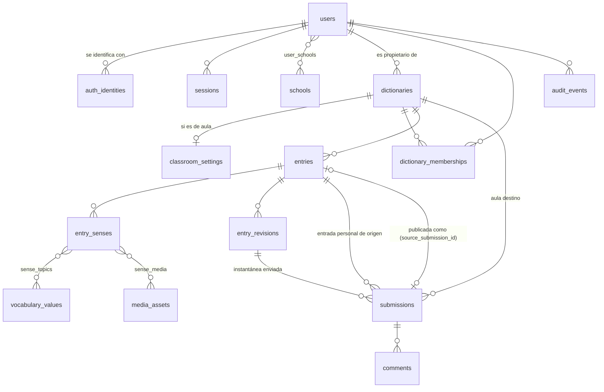

# Modelo de datos

Fuente de verdad: `packages/db/src/schema.ts`. Migraciones revisables en `packages/db/migrations/` (generadas con
`npm run db:generate`, aplicadas con `npm run db:migrate`; la demo aplica las mismas en el navegador).

## Entidades

| Tabla | Propósito | Notas |
|---|---|---|
| `users` | persona usuaria | `display_name`, nombre, apellidos, avatar, `global_role` (`student`, `teacher`, `admin`, `support`), `status`. **Sin** NIF/NIE/pasaporte/CIAL |
| `auth_identities` | identidad de acceso | `provider` `cas` (sujeto del CAS institucional), `cas_test` (sujeto del CAS de pruebas; solo local/demo) o `password` (solo demo/dev, PBKDF2). Único por `(provider, subject)`: emisores distintos nunca comparten cuenta |
| `sessions` | sesiones de la API | *hash* del identificador, caducidad, ticket CAS para SLO |
| `schools`, `user_schools` | centros (CAUCE) | solo estadísticas |
| `vocabulary_values` | listas controladas | `vocabulary` ∈ categoría gramatical, género, número, lenguas, temáticas, niveles, materias, enseñanzas, tipos de diccionario; `code` estable |
| `dictionaries` | diccionario personal o de aula | un personal por persona (índice único parcial); `deleted_at` |
| `classroom_settings` | configuración del aula | código de unión único, curso, vigencia, atemporal, nivel, materia, grupo, máximo de acepciones, `visible_fields`, `required_fields`, pautas (texto), visibilidad, plazo de envíos, visibilidad de comentarios |
| `dictionary_memberships` | participación en un aula | `role` `teacher` / `student`, `active` |
| `entries` | entrada (palabra) | `headword`, `headword_key` (único por diccionario sin borrar), `initial`, `sort_key`, `hidden`, `version`, `source_submission_id` |
| `entry_senses` | acepción | posición, definición, «Más datos», ejemplo de uso, categoría, género, número, lengua + forma, `hidden` |
| `sense_topics` | temáticas de la acepción | |
| `media_assets`, `sense_media` | imagen/audio/vídeo | uno por tipo y acepción; clave de almacenamiento opaca, SHA-256. Los bytes nunca están en SQL: volumen en Docker, IndexedDB en la demo (`media_blobs` se eliminó en la migración 0001) |
| `entry_revisions` | instantánea inmutable | motivo `submit`, `publish`, `teacher_edit` |
| `submissions` | envío al aula | `pending`, `published`, `rejected` (con nota), `withdrawn`; un pendiente por entrada y aula |
| `comments` | comentario del profesorado | a un alumno, opcionalmente sobre un envío; texto plano |
| `audit_events` | auditoría mínima | acción, entidad, metadatos sin contenido |
| `app_settings` | clave/valor | versión de la semilla demo |

## Semántica de estados y borrado

| Concepto | Representación | Regla |
|---|---|---|
| Entrada o diccionario borrado | `deleted_at` | recuperable por administración; no aparece en listados |
| Entrada/acepción oculta | `hidden` | personal: no se envía ni exporta por defecto; aula: invisible para el alumnado |
| Participación deshabilitada | `active = false` | no puede volver a unirse con el código |
| Aula vigente | calculada (`isClassroomCurrent`) | `curso actual − curso de inicio < vigencia` o atemporal |
| Plazo de envíos | calculado (`submissionWindowState`) | habilitado y dentro de inicio/fin y aula vigente |
| Visibilidad de comentarios | `hidden` / `visible` / `before_date` | `before_date`: los creados hasta la fecha indicada |

## Cuándo se crea una revisión

Al enviar (la instantánea que revisa el profesorado), al publicar (la versión publicada) y en cada edición docente de
una entrada publicada. No al guardar cada cambio personal.

## Trazabilidad legacy

Cada tabla migrada tiene `legacy_source` + `legacy_id` con índice único: «¿qué registro nuevo corresponde al legacy X?»
es una consulta directa. No se exponen en la API. Mapeo completo: `docs/LEGACY-DATA-MAPPING.md`.
