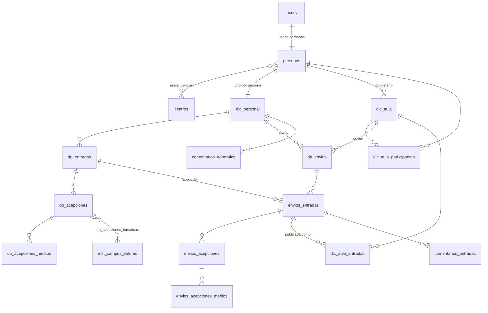

# Modernización de LexiCán

Informe inicial exigido por §104 de `1er-prompt.md`, actualizado con lo que se ha construido. Las cifras del legacy
salen de [`analysis/lexican/BASELINE.md`](../analysis/lexican/BASELINE.md) (cada una con su comando); las métricas
comparadas `upstream` vs `main` las genera `npm run metrics` para `docs/MODERNIZATION-REPORT.md`.

## Estado actual

**Legacy (1.x).** Aplicación Laravel 8 + TCG Voyager con vistas Blade, jQuery, Bootstrap 4 y TinyMCE sobre MariaDB.
Acceso por CAS (paquete phpCAS copiado a mano) y autorización consultando el servicio CAUCE. Alumnado y profesorado
de centros canarios crean diccionarios personales y de aula: entradas, acepciones, medios, envíos al aula, revisión y
publicación, comentarios y PDF. Unas 36 500 líneas escritas a mano en 742 ficheros versionados; la lógica está en
~7 200 líneas de *helpers* globales. No instala tal como está (repositorio Composer caído, versiones bloqueadas por
avisos), no tiene CI y tiene 8 métodos de test. Diagnóstico completo:
[`analysis/lexican/ASSESSMENT.md`](../analysis/lexican/ASSESSMENT.md).

**Reconstrucción (2.x).** Monorepo TypeScript con la demo PGlite, la API Fastify, el migrador y la administración
([ARCHITECTURE.md](ARCHITECTURE.md)). El árbol legacy sigue en `main`, congelado, hasta la fase de limpieza.

## `upstream` vs `main`

| Ref | SHA | Contenido |
|---|---|---|
| `origin/upstream` | `c80ff652b3be44fc5b881060af5abc8c5f8842e8` | «Initial commit: original vendor source». Única versión del código del proveedor; intocable |
| `origin/main` (al iniciar) | `0a270cd4f505872968b992835ecbf127dd9fddc8` | `upstream` + `92b0995` (una línea en `.gitignore`, borra un `.DS_Store`) + `0a270cd` (`1er-prompt.md`) |
| merge-base | `c80ff652b3be44fc5b881060af5abc8c5f8842e8` | `main` desciende directamente de `upstream` |

No hay más diferencias de código entre ambas al empezar. La historia del legacy es un único *import*, sin señal de
frecuencia de cambios. `upstream` contiene credenciales publicadas que no se reescriben (§5): ver
[SECURITY.md](SECURITY.md#credenciales-expuestas-en-el-histórico).

## Inventario funcional

Detalle por funcionalidad, con rutas, controladores y evidencia:
[`analysis/lexican/FUNCTIONAL_INVENTORY.md`](../analysis/lexican/FUNCTIONAL_INVENTORY.md). Reglas de negocio (304,
Given/When/Then): [`analysis/lexican/BUSINESS_RULES.md`](../analysis/lexican/BUSINESS_RULES.md).

| Decisión | Nº | Ejemplos |
|---|---|---|
| conservar | 16 | búsqueda por inicial, temáticas, logout CAS, *health check* |
| rediseñar | 81 | editor de entradas, envíos, revisión y publicación, sesiones, roles, medios, administración |
| eliminar | 20 | registro público de Laravel, `/test`, suplantación CAS, creación de admin en código, tablas `avisos*` |
| dudosa | 6 | grabación desde el navegador, banner de cookies, centros, tipo «Canarismos» |
| **Total** | **123** | más 4 funcionalidades que se esperaban y no existen (p. ej. perfil de usuario) |

Las dudosas se resolvieron con los valores por defecto de
[`analysis/lexican/MODERNIZATION_BRIEF.md`](../analysis/lexican/MODERNIZATION_BRIEF.md) §7.

## Inventario tecnológico

| Pieza | Legacy | Estado | Nuevo (verificado en npm el 2026-10-04) |
|---|---|---|---|
| Lenguaje / runtime | PHP `^8.0\|^8.1` | Laravel 8 no admite PHP 8.5 | TypeScript `~6.0` sobre Node.js `>=24` |
| Framework servidor | Laravel `^8.83` | sin parches de seguridad desde enero de 2023 | Fastify 5.12.5 |
| Administración | TCG Voyager `^1.5` | abandonado; CVE-2025-32931 (crítica) sin corrección | pantallas propias ([ADR 0008](adr/0008-administracion.md)) |
| CAS | `apereo/phpcas` 1.5.0 | CVE-2022-39369 | cliente CAS 3.0 propio + `fast-xml-parser` 5.11 |
| PDF | `barryvdh/laravel-dompdf` 2.0.0 | avisos de dompdf; `enable_php` activo | impresión del navegador |
| Frontend | Blade + jQuery 2.1.3 + Bootstrap 4.6.2 + TinyMCE 5 + Laravel Mix 6 | 25 avisos npm (1 crítico) + 4 CVE de jQuery vendorizado | React 19.3 + Vite 8.3 + react-router 8.4 |
| Base de datos | MariaDB/MySQL, 45 tablas + Voyager + 13 vistas SQL | — | PostgreSQL 18 + Drizzle 0.45.3; PGlite 0.5.8 en la demo |
| Validación | reglas Laravel dispersas | — | Zod 4.6 compartido |
| Tests | PHPUnit, 8 métodos, no ejecutables | — | Vitest 5.0, Playwright 1.63 + axe 4.13 |
| Build / CI | sin *lockfiles* ni CI; `composer.phar` versionado | Composer no resuelve (repositorio `larapack.io` con 404) | npm workspaces + `package-lock.json`; GitHub Actions |
| Despliegue | OpenShift + Apache mod_php + NFS | scripts con hosts internos | imagen Docker multi-stage, volumen de medios |

## Modelo legacy

**Diccionario personal.** Cada persona tiene un `dic_personal`. Sus palabras son `dp_entradas` y cada una tiene
`dp_acepciones` ordenadas, con temáticas (`dp_acepciones_tematicas`) y hasta un medio de cada tipo
(`dp_acepciones_medios`). Entradas y acepciones usan *soft delete* y un `estado` (visible/oculta).

**Envío y publicación.** Al enviar, se crea un `dp_envios` (alumno + aula + curso) y se **copian** las entradas
elegidas a `envios_entradas` (con `dp_entrada_id` de origen), sus acepciones a `envios_acepciones` y sus medios y
temáticas a `envios_acepciones_*`. El profesorado edita esa copia. Publicar no crea otra copia: inserta en
`dic_aula_entradas` un enlace al `envios_entradas` y marca su `estado` como publicado (3). El aula (`dic_aula`) muestra,
por tanto, las copias enviadas que tienen enlace.

Consecuencias que el nuevo modelo corrige: el contenido existe dos veces (personal y envío) y «publicado» es solo un
enlace al envío; los estados se codifican con caracteres mágicos que cambian de significado según la tabla; un mismo envío
se puede publicar en varias aulas por importación; editar lo publicado edita el envío; y los comentarios cuelgan unas
veces del diccionario personal y otras del envío. Mapeo tabla a tabla:
[LEGACY-DATA-MAPPING.md](LEGACY-DATA-MAPPING.md); análisis completo:
[`analysis/lexican/DATA_OBJECTS.md`](../analysis/lexican/DATA_OBJECTS.md).

## Riesgos

| Riesgo | Situación | Mitigación |
|---|---|---|
| Framework/backend legacy | Laravel 8 sin soporte, no instala | reconstrucción; el legacy sigue en servicio hasta el corte |
| Autenticación CAS | phpCAS vulnerable, validación TLS opcional | cliente CAS 3.0 propio con TLS y URL de servicio fija; verificación en preproducción ([AUTHENTICATION.md](AUTHENTICATION.md)) |
| Dependencia de CAUCE | sin TLS verificado, token en el repo, respuestas con NIF/CIAL en logs | adaptador con TLS y *timeout*, solo campos necesarios, sin logs de contenido; rotar el token |
| Voyager | abandonado, CVE crítica, vistas propias ausentes del repo | pantallas de administración propias, especificadas a partir de rutas y reglas |
| Modelo duplicado de envíos/publicación | contenido copiado, publicación como enlace al envío, estados ambiguos | revisiones inmutables + `submissions` + entradas de aula con `source_submission_id` ([ADR 0006](adr/0006-modelo-de-datos.md)) |
| Datos personales | NIF/NIE, CIAL, pasaporte; datos reales en *seeders* | no se migran; datos ficticios; [PRIVACY.md](PRIVACY.md) |
| NFS/medios | ficheros con nombre del cliente en disco público | `MediaStorage` con claves opacas y autorización; el migrador copia y verifica por SHA-256 |
| Migración MariaDB→PostgreSQL | semántica de estados, envíos duplicados, ids distintos por entorno | migrador idempotente con *dry-run*, informe y huérfanos; ensayo sobre copia autorizada |
| CI | inexistente | CI con PostgreSQL y MariaDB; Pages y releases dependen de él |
| Tests | 8 métodos no ejecutables | unitarias, contrato en dos drivers, API, migración y E2E ([TESTING.md](TESTING.md)) |
| Licencias | sin licencia declarada | ninguna licencia hasta que decida el titular ([LICENSING.md](LICENSING.md)) |
| Código de terceros | phpCAS copiado, vendor JS sin gestionar | ningún código copiado; dependencias npm con lista de licencias |
| Exportaciones | dompdf con PHP activado, CSV en la raíz web | exportación en el cliente (CSV, JSON, DMLex) e impresión |
| Contenido HTML legacy | HTML de TinyMCE en comentarios (XSS almacenado) | se convierte a texto plano al migrar |
| Credenciales públicas | `APP_KEY`, tokens CAUCE, contraseñas en el histórico | rotación por operaciones, ya y con independencia de esta obra |

## Arquitectura propuesta

Diagramas de producción y demo, reparto del código y tabla de operaciones: [ARCHITECTURE.md](ARCHITECTURE.md).

## ADR

| ADR | Decisión |
|---|---|
| [0001](adr/0001-reconstruccion.md) | Reconstruir en lugar de actualizar Laravel |
| [0002](adr/0002-stack.md) | TypeScript, React + Vite, Fastify, PostgreSQL, npm workspaces; Zod, Vitest, Playwright |
| [0003](adr/0003-drizzle-pglite.md) | Un esquema Drizzle para PostgreSQL y PGlite; sin interfaces de repositorio duplicadas |
| [0004](adr/0004-demo-pglite.md) | Demo en GitHub Pages con PGlite en IndexedDB |
| [0005](adr/0005-autenticacion.md) | CAS 3.0 propio, adaptador CAUCE, sesiones en PostgreSQL |
| [0006](adr/0006-modelo-de-datos.md) | Diccionarios, envíos como revisiones inmutables, vocabularios controlados |
| [0007](adr/0007-medios-y-exportacion.md) | Medios en sistema de ficheros; exportación sin servicio PDF |
| [0008](adr/0008-administracion.md) | Pantallas de administración propias en lugar de Voyager |

## Nuevo modelo de datos

Diagrama, tabla de entidades, estados y trazabilidad legacy: [DATA-MODEL.md](DATA-MODEL.md). De 45 tablas + Voyager a
20 tablas.

## Estrategia PGlite / GitHub Pages

El build `demo` del mismo frontend carga PGlite con `import()` dinámico tras pintar el acceso, aplica las migraciones
SQL de `packages/db/migrations` con `migrateBundled` (mismas filas en `drizzle.__drizzle_migrations` que en
PostgreSQL), siembra datos ficticios a través de los servicios y guarda todo en IndexedDB `lexican-demo-v2`. Las
operaciones llaman en proceso a los mismos servicios que usa la API. «Restablecer datos de demostración» borra la base
y vuelve a sembrar. Detalle: [DEMO.md](DEMO.md) y [ADR 0004](adr/0004-demo-pglite.md).

## Plan de migración

Mapeo, orden, medios, verificación, *dry-run*, ensayo, corte y vuelta atrás: [MIGRATION.md](MIGRATION.md) y
[LEGACY-DATA-MAPPING.md](LEGACY-DATA-MAPPING.md). Sin escritura doble: el legacy queda en solo lectura durante el
corte y la vuelta atrás es apuntar de nuevo a él.

## Plan PR por PR

| # | PR | Contenido |
|---|---|---|
| 1 | Fase 0 — auditoría | `analysis/lexican/` (evaluación, mapa, reglas, inventarios, *brief*) |
| 2 | Herramientas + núcleo + esquema | npm workspaces, TypeScript, ESLint, Prettier, Vitest; ADR; `packages/core`, `packages/db` (esquema y primera migración), `packages/app` con pruebas de contrato |
| 3 | Web + demo + Pages | React, cliente HTTP y cliente PGlite, E2E de la demo, workflow de Pages, `check:dist` |
| 4 | API | Fastify, sesiones, CAS/CAUCE, subidas, Docker, pruebas de integración y E2E de producción |
| 5 | Migrador | `tools/legacy-migrator`, *fixtures* ficticios, job de CI con MariaDB, `MIGRATION.md` |
| 6 | Administración + documentación + endurecimiento | pantallas de administración, documentación humana, revisión de seguridad y accesibilidad, release |
| 7 | Corte | ensayo con copia autorizada, despliegue, migración real, comprobaciones, legacy en solo lectura |
| 8 | Limpieza | eliminar Laravel, Voyager, Composer, Blade, jQuery y activos vendor de `main`; `upstream` intacta |

## Desviaciones respecto a `1er-prompt.md`

| Prompt | Hecho | Motivo |
|---|---|---|
| Paquetes `domain`, `application`, `contracts`, `db`, `auth`, `testing` (§9) | `core`, `db` y `app` | fronteras reales: lo que comparten navegador y servidor sin base de datos, el esquema, y los casos de uso; `auth` es parte de `app`/`api`, `testing` son helpers en `packages/db/src/testing.ts` ([ADR 0002](adr/0002-stack.md)) |
| Repositorios con interfaces y *adapters* (§18) | servicios sobre Drizzle directamente | un único tipo `Db` sirve para node-postgres y PGlite; las pruebas de contrato recorren la aplicación entera en ambos ([ADR 0003](adr/0003-drizzle-pglite.md)) |
| `migrations/`, `scripts/migration`, `fixtures/demo`, `integration/` (§9) | migraciones en `packages/db/migrations`, migrador en `tools/legacy-migrator`, semilla demo en código, integración junto a la API | menos carpetas; la semilla usa los servicios y cumple las reglas |
| — | react-router 8.4 (línea 8 GA), no la 7 | versión actual verificada; modo datos con *loaders* en lugar de TanStack Query |
| Rutas limpias en Pages | *hash routing* en la demo, rutas normales en producción | Pages no tiene reescrituras; evita `404.html` (§60 lo permite) |
| Node LTS | `>=24`, CI en 24 | 26 pasa a LTS el 2026-10-28; se adoptará tras verificarlo |
| TypeScript actual | `~6.0` | `typescript-eslint` aún no admite 6.1+ ni 7 |
| Testcontainers (propuesto en el *brief*) | contenedor de servicio de GitHub Actions y `TEST_DATABASE_URL` | sin dependencia extra; en local, `docker compose` |
| PDF del servidor | impresión del navegador | elimina dompdf y su superficie de ataque ([ADR 0007](adr/0007-medios-y-exportacion.md)) |
| Miniaturas de vídeo | no | sin FFmpeg en la imagen |
| Cobertura con umbrales (§81) | informe sin umbral bloqueante | pendiente de fijar tras estabilizar ([TESTING.md](TESTING.md)) |
| Tests visuales (§80) y *skills* de agentes (§97) | no incluidos todavía | pendientes |
| Licencia del proyecto (§92) | ninguna | decisión del titular ([LICENSING.md](LICENSING.md)) |
